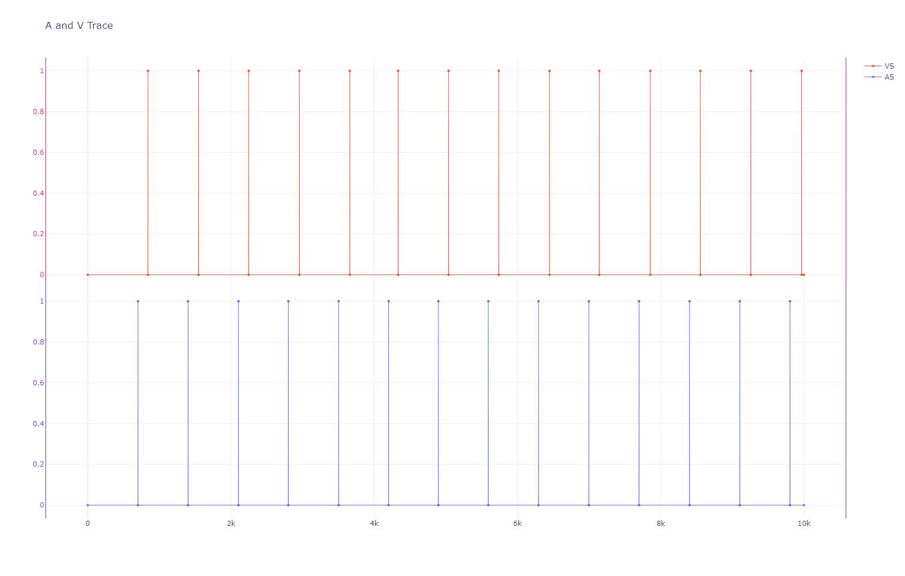

## PyHeart Usage

**依赖**
```python
python 3.8+
numpy
plotly
```
**创建特定患者的数字孪生**
```python
# 创建一个特定病人的虚拟的环境
import Heart as ht
dt = ht.get_system_instance(json_filename='demo_patient.json')
```
`jsonfilename`是患者的特异参数文件，由`json`编写。在`Patients`文件内有样例患者。

**仿真**
```python
# 仿真1000s
dt.reset()
display_value = dt.simulation(sim_time=10000, save_plotly=False)
print(display_value)
```
`sim_time`表示需要仿真多少离散时间，`plotly`表示是否需要返回可视化需要的数据。返回的是仿真后的结果。

**可视化**

需要在仿真时设置 `save_plotly` 为 `True`, 会在当前目录生成一个文件夹以`dt`的创建时间命名的文件夹，存放了仿真的数据。可以通过调用`plotly_system_log`函数进行可视化。

```python
# 可视化仿真结果
dt.reset()
display_value = dt.simulation(sim_time=10000, save_plotly=True)
ht.plotly_system_log('2022_09_17_18_11_34')
```
